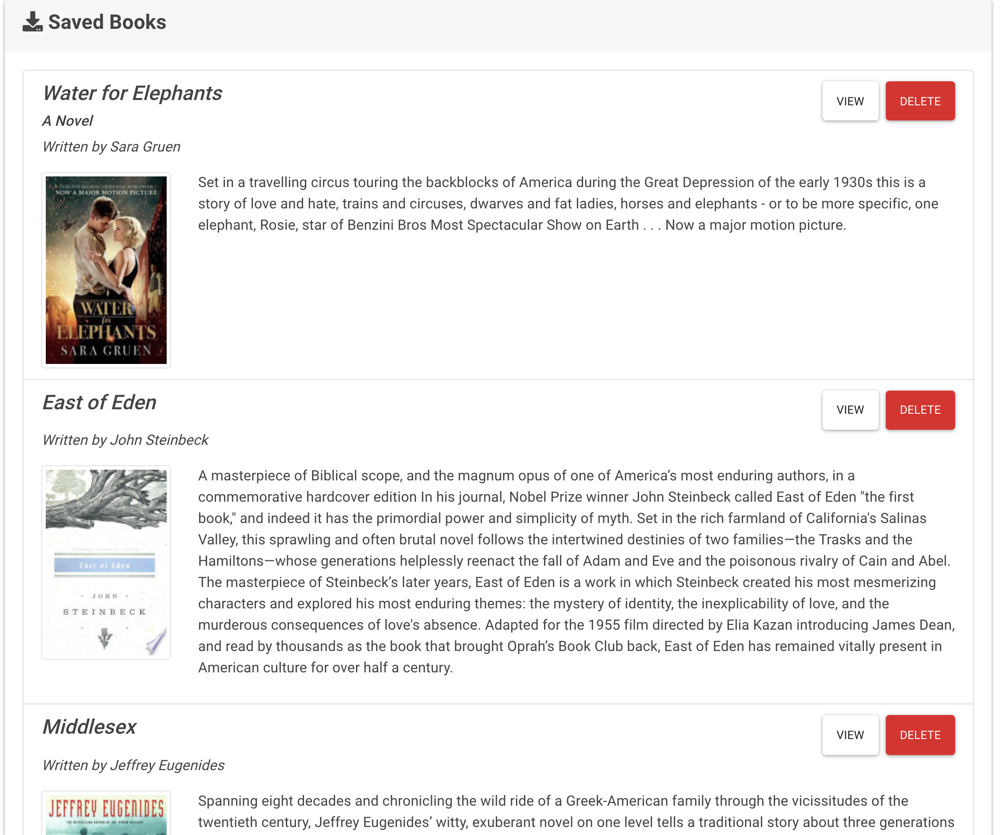
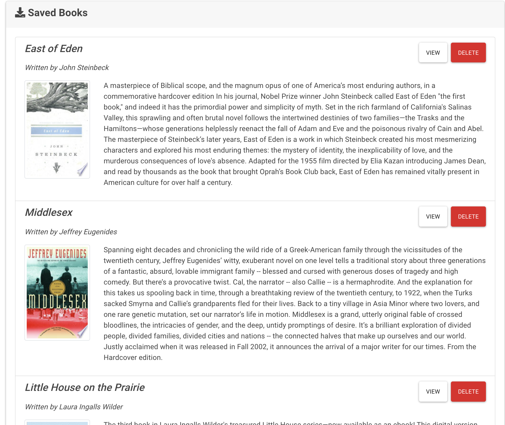
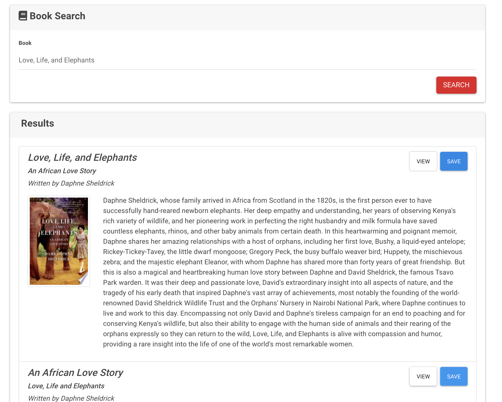
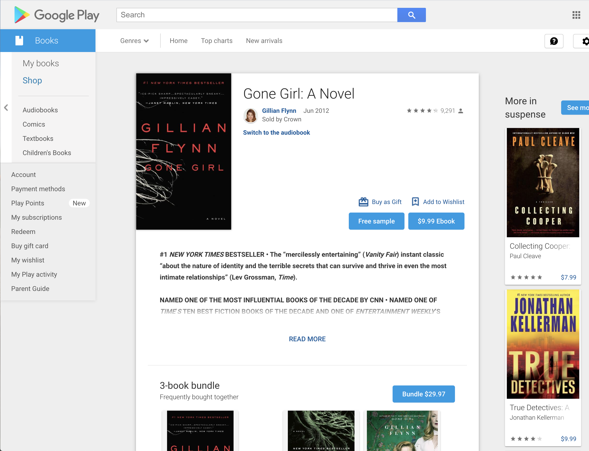

# Google Books Search

Are you searching for a specific book? This app has got you covered!

## Description:

This Google Books Searh app was created with React. It used React components, helper/util functions, and utilized React lifecycle methods to query and display books based on a user's searches. The user has the ability to save books, so they can review or purchase at a later time. 

## Technologies Used:

This application was created using: React, Node.js, NPM, Express, MongoDb, Mongoose

## Author:

Author : Sophia Castillo,

Email : Sphcastillo@gmail.com,

GitHub : https://github.com/sphcastillo,

Heroku Deployed Site :
https://warm-reaches-29237.herokuapp.com/

